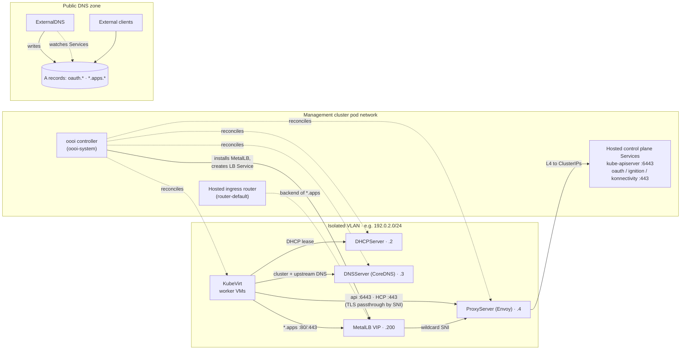
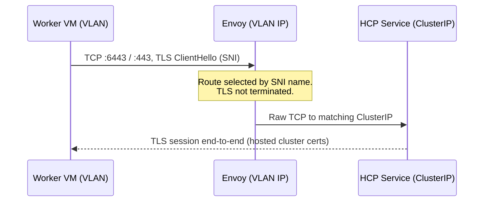
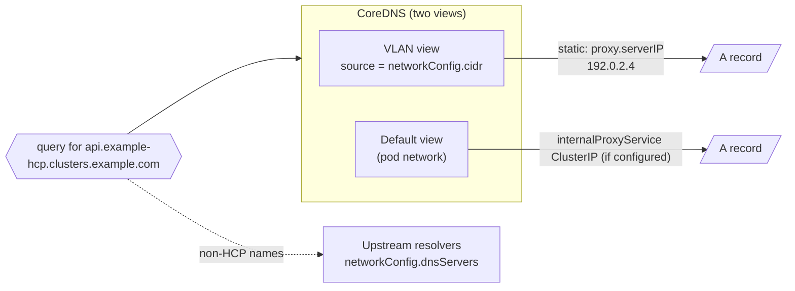

# Architecture

oooi bridges the connectivity gap between KubeVirt worker nodes on an isolated
VLAN and their hosted control plane running on the management cluster's pod
network — **without** opening the management cluster to tenant traffic.

## The problem

OpenShift Hosted Control Planes decouple control planes from workers: hosted
control-plane pods (`kube-apiserver`, OAuth server, Ignition server,
konnectivity) run in a management-cluster namespace such as
`clusters-example-hcp`, while worker nodes are KubeVirt VMs. When those VMs are
placed on an isolated VLAN with `attachDefaultNetwork: false` — desirable for
air-gapped or high-security designs — they lose all direct paths to those
Services.

Conventional workarounds (hosting-cluster Routes for everything, shared load
balancers) require tenant traffic to traverse management-cluster ingress
infrastructure. That breaks strict network isolation.

## The oooi approach

oooi deploys the network services the VLAN is missing *onto* the VLAN itself:



Only two crossing points exist between VLAN and management cluster, both
narrowly scoped:

1. **Envoy** forwards specific SNI names to specific control-plane Service
   ClusterIPs — TCP bytes only, TLS never terminated.
2. **Envoy wildcard backends** forward `*.apps` to the MetalLB VIP that fronts
   the hosted ingress router.

## Components

The user-facing API has two scopes. `Infra` describes the shared VLAN stack;
`InfraClusterAttachment` binds one HostedCluster to that stack and carries its
DNS, control-plane, and optional apps-ingress settings. oooi reconciles the
shared child custom resources in the Infra namespace; each child manages its
own Deployment, Services, ConfigMap, and ServiceAccount. When OpenShift
integration is enabled, the relevant child also manages its component-scoped
SCC RoleBinding. Pods reference the configured NetworkAttachmentDefinition
through Multus annotations; oooi does not create the NAD.

| Component | Child CR | Image | Role |
|---|---|---|---|
| `InfraReconciler` | — | `registry.example.com/oooi` | Creates shared children, aggregates attachment routes, and reports shared status |
| `InfraClusterAttachmentReconciler` | — | `registry.example.com/oooi` | Binds one HostedCluster, manages its control-plane policy, and drives optional apps ingress |
| DHCP | `DHCPServer` | Infra-generated: oooi image; standalone API default: HyperDHCP image | Serves leases on the VLAN; discovers KubeVirt VM interfaces to keep leases stable |
| DNS | `DNSServer` | oooi image (CoreDNS component) | Split-horizon views; static HCP answers; upstream forwarding |
| Proxy | `ProxyServer` | Envoy + oooi xDS sidecar | L4 TLS-passthrough gateway; SNI routing; apps wildcard backends |
| Apps ingress | `InfraClusterAttachment` | MetalLB operator | Installs MetalLB into the attached hosted cluster, allocates and advertises its wildcard VIP |

### Ownership and garbage collection

The three child CRs carry owner references to `Infra`. Deleting `Infra`
garbage-collects those child CRs and their namespaced workloads, Services, and
RBAC. The control-plane NetworkPolicy and DHCP ClusterRole/ClusterRoleBinding
cannot carry an `Infra` owner reference because they are cross-namespace or
cluster-scoped; remove them during cleanup. Apps-ingress resources live in the
hosted cluster and must also be checked and removed separately. See
[Uninstall and cleanup](operations/uninstall.md) for the supported teardown
order.

## Traffic flows

### Control plane (API, OAuth, Ignition, konnectivity)



- `api.<cluster>.<domain>:6443` → `controlPlaneNamespace/kube-apiserver`
- `oauth|ignition|konnectivity.<cluster>.<domain>:443` → matching HCP Services

For a KubeVirt worker, the shared proxy also supports these service aliases on
port `443`:

```text
kubernetes
kubernetes.default
kubernetes.default.svc
kubernetes.default.svc.cluster.local
```

The aliases resolve to the one VLAN proxy address. They are not globally
ambiguous at the proxy: the Infra controller finds KubeVirt NodePools and their
CAPI `Machine` objects, filters `Machine.status.addresses` to the shared
`networkConfig.cidr`, and emits one Envoy backend per attachment with sorted
`/32` `sourcePrefixRanges`. A Machine address outside that CIDR is ignored.
The controller consumes the addresses exposed in Machine status; validate the
CAPK address-selection and refresh behavior for the target release. Until an
in-CIDR address is available, the attachment keeps its fully qualified routes
but has no alias backend; the controller retries discovery.

The source address is a routing selector, not an identity mechanism. A client
that can spoof another worker's VLAN address can select another attachment, so
use CNI, switch, or DHCP anti-spoofing controls when the VLAN is shared by
untrusted tenants.

Because Envoy never terminates TLS, certificates remain inside the hosted
cluster and the proxy cannot inspect tenant traffic.

On port `443`, the generated configuration also includes a legacy konnectivity
fallback when a non-source-scoped konnectivity backend exists. It is intended
for no-SNI clients, but the catch-all filter chain can receive unmatched SNI or
source traffic too; it is not an alias route or an access-control boundary.

### Apps ingress (wildcard `*.apps`)

For an attachment with `spec.appsIngress.enabled: true`:

1. oooi waits for a Ready hosted worker (OLM's MetalLB bundle-unpack Job needs
   schedulable capacity).
2. Installs the Red Hat MetalLB operator subscription in the hosted cluster,
   then `MetalLB`, an `IPAddressPool`, and an `L2Advertisement`.
3. Creates a `LoadBalancer` Service (default name `oooi-ingress`) in the hosted
   cluster's `openshift-ingress` namespace, selector fixed to the default
   IngressController deployment.
4. Reads the allocated IP or hostname from Service status and publishes it as
   `InfraClusterAttachment.status.appsIngressStatus.externalIP` or
   `.externalHostname`.
5. Adds the `*.apps.<cluster>.<domain>` A record to the VLAN DNS view only when
   an external IP exists and, when `internalProxyService` is configured, to the
   pod-network view; it adds Envoy wildcard backends for either an IP or a
   hostname endpoint.

MetalLB **L2 mode** advertises the VIP from a hosted worker itself, so the
worker VMs reach the ingress without any external load balancer.

### DNS split-horizon



Both views answer identically for names *outside* the static zones — only the
HCP endpoint, `*.apps`, and conditional Kubernetes alias names differ per view.
The aliases still resolve to one shared proxy address; source matching happens
after the TCP connection reaches Envoy.

## Security model

| Aspect | Design |
|---|---|
| TLS | Passthrough only; no keys or secrets on the proxy |
| Exposed ports | VLAN: DHCP/67+68, DNS/53, proxy `443`+`6443`; Envoy admin `9901` stays ClusterIP-only |
| External exposure | Each enabled attachment gets a `<attachment>-proxy-external` LoadBalancer exposing **only** the configured ingress port — never admin or backend ports |
| OpenShift SCC | With `--enable-openshift=true`, scoped SCC RoleBindings are created: `privileged` for DHCP and Proxy, and `anyuid` for DNS. Without the flag, grant equivalent permissions through cluster policy. |
| Control-plane policy | An ingress-only `allow-infrastructure` NetworkPolicy selects all pods in the control-plane namespace and allows traffic from namespaces labeled `hostedcluster.densityops.com/network-policy-group=infrastructure` |
| Network scope | No general tenant route into the management network; Envoy permits only configured control-plane and apps backends |

## Status model

`Infra.status` reports reconciliation state. It does not replace checking the
child Deployments for runtime availability:

```text
status:
  conditions:              # Ready / ReconciliationSucceeded / Degraded ...
  componentStatus:         # dhcpReady, dnsReady, proxyReady

# On the corresponding InfraClusterAttachment:
status:
  appsIngressStatus:
    phase:                 # Pending | Ready | Degraded
    reason:                # WaitingForHostedClusterNodes, WaitingForExternalIP, ...
    message:               # human-readable detail when Degraded
    externalIP:            # assigned IP, when the endpoint is IP-backed
    externalHostname:      # assigned hostname, otherwise
```

See [Verification](operations/verify.md) for ready-made queries and expected
values.
