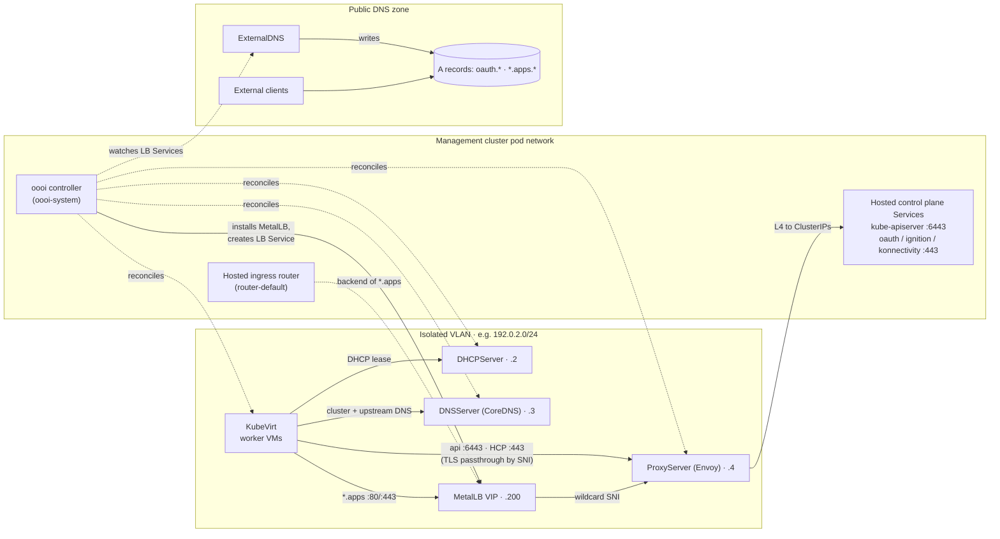
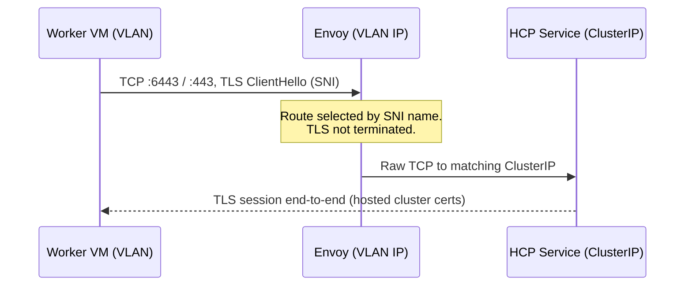
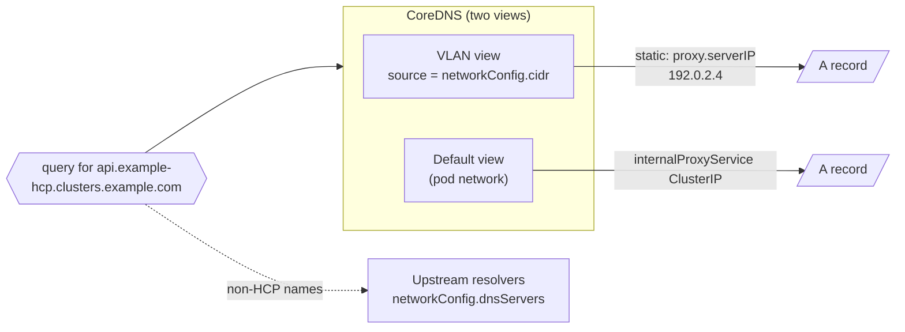

# Architecture

oooi bridges the connectivity gap between KubeVirt worker nodes on an isolated
VLAN and their hosted control plane running on the management cluster's pod
network — **without** opening the management cluster to tenant traffic.

## The problem

OpenShift Hosted Control Planes decouple control planes from workers: hosted
control-plane pods (`kube-apiserver`, OAuth server, Ignition server,
konnectivity) run in a management-cluster namespace such as
`clusters-example-hcp`, while worker nodes are KubeVirt VMs. When those VMs are
placed on an isolated VLAN with `attachDefaultNetwork: false` — desirable for
air-gapped or high-security designs — they lose all direct paths to those
Services.

Conventional workarounds (hosting-cluster Routes for everything, shared load
balancers) require tenant traffic to traverse management-cluster ingress
infrastructure. That breaks strict network isolation.

## The oooi approach

oooi deploys the network services the VLAN is missing *onto* the VLAN itself:



Only two crossing points exist between VLAN and management cluster, both
narrowly scoped:

1. **Envoy** forwards specific SNI names to specific control-plane Service
   ClusterIPs — TCP bytes only, TLS never terminated.
2. **Envoy wildcard backends** forward `*.apps` to the MetalLB VIP that fronts
   the hosted ingress router.

## Components

The user-facing API is the `Infra` custom resource. oooi reconciles it into
child custom resources in the same namespace; each child manages its own
Deployment, Services, ConfigMap, ServiceAccount, SCC RoleBinding, and Multus
attachment.

| Component | Child CR | Image | Role |
|---|---|---|---|
| `InfraReconciler` | — | `registry.example.com/oooi` | Validates input, creates children, drives apps-ingress automation, aggregates status |
| DHCP | `DHCPServer` | oooi image | Serves leases on the VLAN; discovers KubeVirt VM interfaces to keep leases stable |
| DNS | `DNSServer` | CoreDNS | Split-horizon views; static HCP answers; upstream forwarding |
| Proxy | `ProxyServer` | Envoy + oooi xDS sidecar | L4 TLS-passthrough gateway; SNI routing; apps wildcard backends |
| Apps ingress | (part of Infra) | MetalLB operator | Installs MetalLB into the hosted cluster, allocates and advertises the wildcard VIP |

### Ownership and garbage collection

Every created object carries an owner reference chain up to the `Infra`
resource (`ctrl.SetControllerReference`). Deleting `Infra` garbage-collects the
three child CRs, their workloads, Services, NetworkPolicies, and RBAC.
Uninstalling the operator does **not** delete existing `Infra` resources' state
unexpectedly — see [Uninstall and cleanup](operations/uninstall.md) for the
supported teardown order.

## Traffic flows

### Control plane (API, OAuth, Ignition, konnectivity)



- `api.<cluster>.<domain>:6443` → `controlPlaneNamespace/apiServerService`
- `oauth|ignition|konnectivity.<cluster>.<domain>:443` → matching HCP Services

Because Envoy never terminates TLS, certificates remain inside the hosted
cluster and the proxy cannot inspect tenant traffic.

### Apps ingress (wildcard `*.apps`)

1. oooi waits for a Ready hosted worker (OLM's MetalLB bundle-unpack Job needs
   schedulable capacity).
2. Installs the Red Hat MetalLB operator subscription in the hosted cluster,
   then `MetalLB`, an `IPAddressPool`, and an `L2Advertisement`.
3. Creates a `LoadBalancer` Service (default name `oooi-ingress`) in the hosted
   cluster's `openshift-ingress` namespace, selector fixed to the default
   IngressController deployment.
4. Reads the allocated IP from Service status and publishes it as
   `.status.appsIngressStatus.externalIP`.
5. Adds the `*.apps.<cluster>.<domain>` answers to both DNS views and adds
   wildcard SNI backends to Envoy pointing at the VIP.

MetalLB **L2 mode** advertises the VIP from a hosted worker itself, so the
worker VMs reach the ingress without any external load balancer.

### DNS split-horizon



Both views answer identically for names *outside* the static zones — only the
HCP endpoint and `*.apps` names differ per view.

## Security model

| Aspect | Design |
|---|---|
| TLS | Passthrough only; no keys or secrets on the proxy |
| Exposed ports | VLAN: DHCP/67+68, DNS/53, proxy `443`+`6443`; Envoy admin `9901` stays ClusterIP-only |
| External exposure | Optional `<infra>-proxy-external` LoadBalancer exposes **only** the configured ingress port — never admin or backend ports |
| OpenShift SCC | With `--enable-openshift=true`, a scoped `privileged` SCC RoleBinding is created for the proxy ServiceAccount (privileged ports <1024) |
| Egress policy | A namespace NetworkPolicy `allow-infrastructure` permits the proxy's required paths |
| Tenant isolation | No tenant-to-management routes; hosted clusters never need to reach hosting-cluster ingress |

## Status model

`Infra.status` aggregates everything a sysadmin needs:

```text
status:
  conditions:              # Ready / ReconciliationSucceeded / Degraded ...
  componentStatus:         # dhcpReady, dnsReady, proxyReady
  appsIngressStatus:
    phase:                 # Pending | Ready | Degraded
    reason:                # WaitingForHostedClusterNodes, WaitingForExternalIP, ...
    message:               # human-readable detail when Degraded
    externalIP:            # assigned VIP
```

See [Verification](operations/verify.md) for ready-made queries and expected
values.
