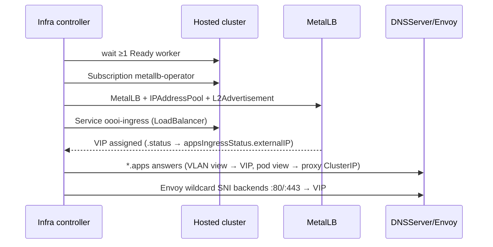

# Apps ingress and MetalLB

With `spec.appsIngress.enabled: true`, oooi turns on wildcard
`*.apps.<cluster>.<domain>` routing for the hosted cluster: MetalLB is
installed *inside the hosted cluster*, a LoadBalancer VIP fronts the default
IngressController, and both DNS views plus Envoy are wired to it.

The feature is intentionally separate from the control-plane proxy endpoints:
app traffic terminates at the hosted ingress router (TLS by Routes), while
Envoy only provides reachability from both networks.

## What oooi does, in order

1. **Waits for a Ready hosted worker.** OLM's MetalLB bundle-unpack Job needs a
   schedulable node; starting earlier would time out.
2. **Installs the Red Hat MetalLB Operator** — Subscription in hosted-cluster
   namespace `openshift-operators` (`redhat-operators`, channel `stable`,
   automatic approval).
3. **Waits for MetalLB CRDs**, then ensures `MetalLB/metallb`, an
   `IPAddressPool`, and an `L2Advertisement` in `openshift-operators`.
4. **Creates/updates the LoadBalancer Service** (default
   `openshift-ingress/oooi-ingress`) with selector fixed to:
   `ingresscontroller.operator.openshift.io/deployment-ingresscontroller: default`
5. **Reads the allocated endpoint** from Service status and publishes it as
   `.status.appsIngressStatus.externalIP` / `.externalHostname`.
6. **Publishes DNS and Envoy backends** for `*.apps.<cluster>.<domain>` — only
   after a real external endpoint exists.



## Configuration

```yaml
spec:
  appsIngress:
    enabled: true
    hostedClusterRef:
      name: species-8472
      namespace: clusters
    metallb:
      addressPoolName: vlan203-apps
      ipAddressPoolRange: 10.202.64.180-10.202.64.190   # unused L2 space!
      # l2AdvertisementName: advertise-vlan203-apps     # optional override
    service:
      name: oooi-ingress                # defaults shown
      namespace: openshift-ingress
      annotations:                      # merged every reconcile — ExternalDNS hook
        external-dns.alpha.kubernetes.io/hostname: "*.apps.species-8472.clusters.example.com."
      labels:
        external-dns.blahonga.me/publish: "yes"
    ports:
      http: 80
      https: 443
```

### IP planning rules

`ipAddressPoolRange` must be **unused, routable addresses on the same L2
network as the hosted worker interfaces** (MetalLB L2 mode advertises the VIP
from a worker). Do not include:

- the VLAN gateway,
- DHCP/DNS/proxy static IPs,
- the DHCP dynamic pool,
- any other load balancer's range.

### Service metadata rules

- `service.labels` / `service.annotations` are **merged** onto the Service at
  every reconcile; unrelated existing metadata is preserved.
- The annotation `metallb.universe.tf/address-pool` is **operator-owned**
  (set from `metallb.addressPoolName`). Never put it in
  `service.annotations`.
- Trailing dots in hostname annotations (`…example.com.`) mark FQDNs for
  ExternalDNS.

## Status phases

| Phase | Reason | Meaning |
|---|---|---|
| `Pending` | `WaitingForHostedClusterNodes` | No Ready hosted worker yet |
| `Pending` | `WaitingForMetalLBCRDs` | Subscription installing |
| `Pending` | `WaitingForExternalIP` | MetalLB has not assigned the VIP yet (re-checks every 15s) |
| `Ready` | `ReconciliationSucceeded` | VIP known, DNS + Envoy wired |
| `Degraded` | `HostedClusterAccessFailed`, `MetalLBInstallFailed`, `IngressServiceFailed`, `ExternalIPDiscoveryFailed` | See `.message`; requeued |

Query:

```bash
kubectl -n clusters get infra species-8472 \
  -o jsonpath='{.status.appsIngressStatus.phase}{" "}{.status.appsIngressStatus.reason}{" ip="}{.status.appsIngressStatus.externalIP}{"\n"}'
```

For degraded states inspect the hosted cluster through its admin kubeconfig:

```bash
kubectl --kubeconfig=<hosted-kubeconfig> -n openshift-operators \
  get subscription,csv,metallb,ipaddresspool,l2advertisement
kubectl --kubeconfig=<hosted-kubeconfig> -n openshift-ingress get svc oooi-ingress -o wide
```

## Verification

An allocated VIP alone proves little — confirm all three paths:

1. **VLAN → VIP**: `dig @<dns.serverIP> foo.apps.<cluster>.<domain>` returns
   the VIP; `curl -k https://console-openshift-console.…` returns 200.
2. **Pod network → proxy ClusterIP**: same query against the DNS ClusterIP.
3. **Public → VIP** (if ExternalDNS is used): query your public resolver.

Details and expected values: [Verification](../operations/verify.md).

## Limitations

- Only the **default** IngressController can be selected; custom selectors are
  not configurable today.
- IPv4 / L2-advertisement based. Validate dual-stack and BGP designs separately.
- Public DNS records are never written by oooi itself — see the next guide.
