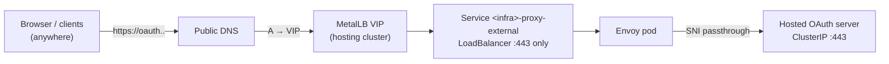

# Public DNS and OAuth publishing

oooi manages **VLAN-side** DNS itself but deliberately does **not** write
public DNS records. This guide explains who can publish what, and gives two
supported patterns: publishing the `*.apps` wildcard, and putting the **OAuth**
endpoint on a MetalLB VIP when HyperShift forces the `Route` strategy.

## Ownership matrix

| Record | Created by | Watched Service | Where that Service lives |
|---|---|---|---|
| `*.apps.<cluster>.<domain>` | Your ExternalDNS | `<service.name>` (`oooi-ingress`) | **Hosted** cluster `openshift-ingress` |
| `oauth.<cluster>.<domain>` (public VIP) | Your ExternalDNS | `<infra>-proxy-external` | **Hosting** (management) cluster, Infra namespace |
| VLAN views of both | **oooi** (automatic) | — | DNSServer static zones |

Key constraint: an ExternalDNS instance can only see Services in the cluster
its kubeconfig points at. A default management-cluster ExternalDNS **cannot**
see the hosted cluster's `oooi-ingress` Service.

## Pattern A — publish the `*.apps` wildcard

Run an ExternalDNS instance that can watch the hosted cluster. Two variants:

=== "ExternalDNS Operator inside the hosted cluster"

    The OpenShift ExternalDNS Operator (≥ 1.3.0) supports hosted clusters and
    watches Services through its label filter. Configure the `ExternalDNS`
    resource with your provider credentials and a label filter such as
    `external-dns.example.com/publish=yes`, then make sure the Infra resource
    carries the matching metadata:

    ```yaml
    appsIngress:
      service:
        annotations:
          external-dns.alpha.kubernetes.io/hostname: "*.apps.mycluster.example.com."
        labels:
          external-dns.example.com/publish: "yes"
    ```

=== "Dedicated Deployment with a hosted-cluster kubeconfig"

    Run upstream ExternalDNS anywhere, pointed at the hosted API via a
    kubeconfig secret. The repository ships a working sample
    ([`config/samples/species-8472-external-dns.yaml`](https://github.com/cldmnky/oooi/blob/main/config/samples/species-8472-external-dns.yaml))
    with arguments like:

    ```yaml
    args:
      - --kubeconfig=/etc/kubeconfig/config          # hosted-cluster kubeconfig
      - --provider=aws
      - --source=service
      - --policy=sync                                # also removes stale records
      - --registry=txt
      - --txt-owner-id=species-8472-external-dns
      - --txt-prefix=external-dns-
      - --zone-id-filter=Z0744581GI2T7BTVHI4Y       # your public zone
      - --label-filter=external-dns.blahonga.me/publish=yes
      - --service-type-filter=LoadBalancer
    ```

    Build the hosted-cluster kubeconfig so it resolves internally (avoids
    depending on public DNS during bootstrap):

    ```bash
    tmp=$(mktemp -d)
    kubectl -n clusters get secret species-8472-admin-kubeconfig \
      -o jsonpath='{.data.kubeconfig}' | base64 -d > "$tmp/config"
    sed -i.bak \
      's#server: https://api.species-8472.clusters.example.com:6443#server: https://kube-apiserver.clusters-species-8472.svc.cluster.local:6443\n    tls-server-name: api.species-8472.clusters.example.com#' \
      "$tmp/config"
    rm -f "$tmp/config.bak"
    kubectl -n external-dns-operator create secret generic \
      species-8472-external-dns-kubeconfig \
      --from-file=config="$tmp/config" --dry-run=client -o yaml | kubectl apply -f -
    rm -rf "$tmp"
    ```

    !!! warning

        Prefer a read-only hosted-cluster ServiceAccount kubeconfig instead of
        the admin kubeconfig in shared environments.

## Pattern B — publish OAuth via a hosting-cluster VIP

On KubeVirt, HyperShift rejects `oauthServer.type: LoadBalancer` (only
self-managed Azure allows it) and defaults OAuth to `Route`. Because
`spec.services` is **immutable**, you cannot switch later. The supported path:



1. Enable the external Service on the proxy — it selects the same Envoy pod
   but exposes **only** the configured ingress port (443). Envoy's admin port
   `9901` and backend ports stay ClusterIP-only:

   ```yaml
   infraComponents:
     proxy:
       enabled: true
       serverIP: 10.202.64.4
       controlPlaneNamespace: clusters-species-8472
       externalService:
         enabled: true
         addressPoolName: metallb-pool            # hosting-cluster IPAddressPool
         annotations:
           external-dns.alpha.kubernetes.io/hostname: oauth.species-8472.clusters.example.com.
         labels:
           external-dns.blahonga.me/publish: "yes"
   ```

2. Ensure the HostedCluster uses the default `Route` OAuth publishing strategy
   (KubeVirt default) so the OAuth Route exists under the cluster domain.
3. Let any ExternalDNS that watches the **hosting cluster** pick up the new
   LoadBalancer Service — it lives in your Infra namespace, so no special
   kubeconfig is needed:

   ```bash
   kubectl -n clusters get svc species-8472-proxy-external -o wide
   # TYPE           EXTERNAL-IP     PORT(S)
   # LoadBalancer   10.201.0.21     443:32241/TCP
   ```

4. Verify convergence:

   ```bash
   dig +short oauth.species-8472.clusters.example.com @1.1.1.1   # → the VIP
   curl -k -o /dev/null -w '%{http_code}\n' \
     'https://oauth.species-8472.clusters.example.com/oauth/authorize?client_id=openshift-challenging-client&response_type=token'
   # → 401 (unauthenticated reach = healthy path)
   ```

Because the record is derived from Service status, **VIP changes follow
automatically** — no stale records after pool changes or re-allocation.

## Why this design

| Alternative | Rejected because |
|---|---|
| `oauthServer.type: LoadBalancer` on KubeVirt | HyperShift rejects it at admission; only self-managed Azure supports it; `spec.services` immutable |
| Publishing via hosting-cluster router Routes | Exposes tenant traffic on the hosting cluster's ingress infrastructure — breaks isolation goals |
| Manual A records | Stale after VIP changes; silently breaks console/canary route health |

## Cleanup

Records are removed by their owners:

- Deleting the `proxy.externalService.enabled` flag (or the `Infra`) removes
  the Service; a `--policy=sync` ExternalDNS deletes its records on the next
  sync.
- Deleting the hosted-cluster ExternalDNS instance leaves its TXT/A pairs
  orphaned — delete the Deployment **and** remove leftover records manually if
  the zone must be clean. See [Uninstall and cleanup](../operations/uninstall.md).
