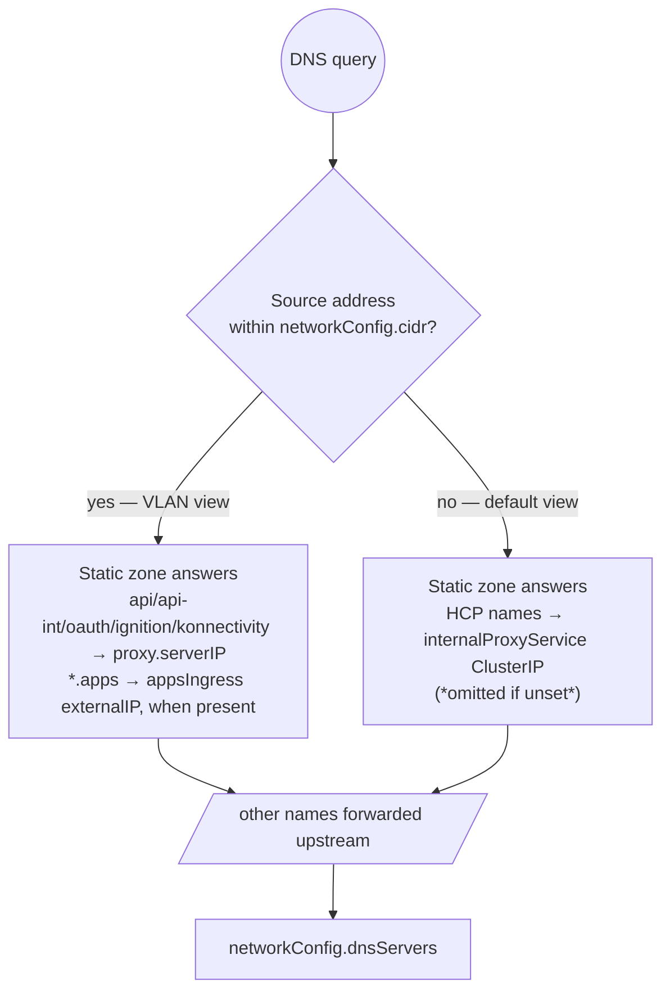

# Split-horizon DNS

The `DNSServer` runs CoreDNS with **two views**: one answering queries that
arrive from the VLAN, and one for everything else (the management-cluster pod
network). This lets the *same* hostnames resolve differently depending on where
the client sits.

## Why two views?

| Client | Needs `api.<cluster>.<domain>` to resolve to |
|---|---|
| Worker VM on the VLAN | The Envoy proxy's VLAN address (`proxy.serverIP`) — the only reachable path |
| Management-cluster pod | The proxy Service ClusterIP (`internalProxyService`) — VLAN addresses are unreachable from pods |

Without the pod-network view, tools inside the management cluster (CI runners,
ACM agents, debug pods) either fail or leak through public DNS.

## How source-based views work



- The **VLAN view** is selected by source IP within `networkConfig.cidr`.
- The **default view** serves everyone else.
- Only names in the static zones differ between views; all other queries are
  forwarded identically to `networkConfig.dnsServers`.

For a shared `Infra`, the VLAN view publishes the same proxy address for the
four Kubernetes aliases `kubernetes`, `kubernetes.default`,
`kubernetes.default.svc`, and `kubernetes.default.svc.cluster.local`. The
default view uses the resolved proxy Service ClusterIP when
`internalProxyService` is configured. DNS cannot choose a hosted cluster for
these names; Envoy uses the worker source IP after the connection arrives.
The alias records are omitted until a KubeVirt worker address inside the Infra
CIDR is available.

## Configuring

### Upstream resolvers

```yaml
spec:
  networkConfig:
    dnsServers:
      - 198.51.100.53        # explicit IPs (recommended)
      - 198.51.100.54
```

Use the literal value `"resolv.conf"` on networks without direct egress to
public resolvers — CoreDNS then inherits the node's configured nameservers:

```yaml
    dnsServers:
      - "resolv.conf"
```

### Pod-network view

Set `infraComponents.proxy.internalProxyService` to the proxy ClusterIP
Service DNS name (or a literal ClusterIP):

```yaml
    proxy:
      internalProxyService: example-hcp-proxy.clusters.svc.cluster.local
```

oooi resolves the name and publishes its ClusterIP in the default view. If you
omit it, the default view contains **no** static HCP answers — a deliberate
choice when pods should never see hosted endpoints.

## Verification

From a **VLAN client** (`192.0.2.3` is the DNSServer):

```bash
dig @192.0.2.3 +short api.example-hcp.clusters.example.com
# → 192.0.2.4   (proxy.serverIP)

dig @192.0.2.3 +short kubernetes.default.svc
# → 192.0.2.4   (published when the worker source range is known)

dig @192.0.2.3 +short console-openshift-console.apps.example-hcp.clusters.example.com
# → MetalLB VIP, e.g. 192.0.2.200, when appsIngressStatus.externalIP is set

dig @192.0.2.3 +short www.example.net
# → forwarded answer from your resolvers
```

From the **pod network**, query the DNSServer's ClusterIP:

```bash
export DIAGNOSTICS_IMAGE=registry.example.com/diagnostics:latest
DNSCLUSTERIP=$(kubectl -n clusters get svc example-hcp-dns \
  -o jsonpath='{.spec.clusterIP}')
kubectl run dnstest --rm -it --image="$DIAGNOSTICS_IMAGE" \
  --restart=Never -- \
  nslookup api.example-hcp.clusters.example.com "$DNSCLUSTERIP"
# → the proxy Service ClusterIP
```

Set `DIAGNOSTICS_IMAGE` to an image in your registry that provides `nslookup`.

If apps ingress reports only `externalHostname`, Envoy can use that hostname as
its target, but oooi does not add a wildcard A record to either DNS view. Use an
IP-backed endpoint for oooi-generated split-horizon apps records.

Watch live query logs while testing:

```bash
kubectl -n clusters logs deploy/example-hcp-dns -f
```

## Troubleshooting

See the DNS rows in [Troubleshooting](../operations/troubleshooting.md) for
symptom → cause → fix guidance (wrong NAD, missing forwarders, DHCP handing out
the wrong resolver, etc.).
