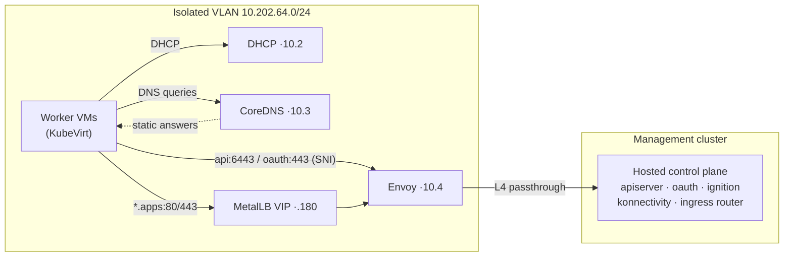

<!-- oooi: meet Ollie, the octopus who runs your VLAN infrastructure -->

# **oooi** { .gradient-text }

### OpenShift on OpenShift Infra

Infrastructure services for OpenShift Hosted Control Planes on isolated networks —
**O**pen**S**hift **o**n **O**penShift **I**nfra.

Kubernetes operator that provisions **DHCP**, **split-horizon DNS**, and a
**TLS-passthrough L4 proxy** onto an isolated VLAN so KubeVirt worker nodes can
reach their hosted control plane — without ever exposing the management cluster.

[Get started :material-arrow-right:](getting-started/quickstart.md){ .md-button .md-button--primary }
[Architecture :material-sitemap-outline:](architecture.md){ .md-button }

<figure markdown class="oooi-mascot">
  
</figure>

---

## Why oooi?

When you run OpenShift **Hosted Control Planes (HCP)** on **OpenShift
Virtualization** with worker VMs attached to an isolated VLAN
(`attachDefaultNetwork: false`), those workers have *no route* to the hosted
control plane Services, which live on the management cluster's pod network.
Traditional fixes — Routes on the hosting cluster's ingress or shared load
balancers — punch holes through your network isolation.

**oooi takes the opposite approach:** it moves the required network services
*onto* the isolated VLAN. Tenant clusters never need connectivity into the
management cluster; only tightly scoped SNI passthrough traffic leaves the VLAN,
and only toward the specific control-plane Services you declare.

## Feature highlights

-   :material-server-network-outline: __Declarative infrastructure__

    ---

    One `Infra` custom resource describes the VLAN and the hosted cluster. The
    operator reconciles `DHCPServer`, `DNSServer`, and `ProxyServer` resources
    and keeps them converged — with automatic garbage collection on delete.

-   :material-ip-network-outline: __Static IPAM with KubeVirt awareness__

    ---

    Each component gets a fixed IP on the secondary network via Multus. The DHCP
    server discovers KubeVirt VM interfaces so existing leases stay stable
    across reconciliation.

-   :material-dns-outline: __Split-horizon DNS__

    ---

    Dual-view CoreDNS: VMs on the VLAN resolve `api.*`, `oauth.*`, and
    `*.apps.*` names to VLAN addresses; management-cluster pods resolve the same
    names to internal ClusterIPs. Everything else is forwarded upstream.

-   :material-security-network: __TLS passthrough SNI proxy__

    ---

    Envoy routes by Server Name Indication without terminating TLS. Certificates
    never leave the hosted cluster; the proxy sees only encrypted bytes.

-   :material-apps: __Wildcard apps ingress automation__

    ---

    Installs MetalLB into the hosted cluster, creates the `*.apps.*`
    LoadBalancer VIP for the default IngressController, wires wildcard SNI
    backends, and publishes both DNS views.

-   :label: __ExternalDNS integration__

    ---

    Declarative labels and annotations on LoadBalancer Services let ExternalDNS
    publish OAuth and `*.apps` records to Route53, Azure DNS, or any provider —
    records follow VIP changes automatically.

## How it fits together

## Documentation map

| I want to… | Go to |
|---|---|
| Understand what must exist before installing | [Prerequisites](getting-started/prerequisites.md) |
| Deploy a hosted cluster end to end | [Quickstart](getting-started/quickstart.md) |
| Understand the moving parts | [Architecture](architecture.md) |
| Install / upgrade / remove the operator | [Installation](installation/index.md) |
| Look up an `Infra` spec field | [Infra CR reference](configuration/infra-reference.md) |
| Configure DNS views or upstream resolvers | [Split-horizon DNS](guides/split-horizon-dns.md) |
| Expose consoles and routes (`*.apps`) | [Apps ingress and MetalLB](guides/apps-ingress.md) |
| Publish OAuth / `*.apps` in public DNS | [Public DNS and OAuth publishing](guides/public-dns-oauth.md) |
| Copy a working manifest | [Examples](examples/index.md) |
| Verify or debug a running deployment | [Operations](operations/index.md) |
