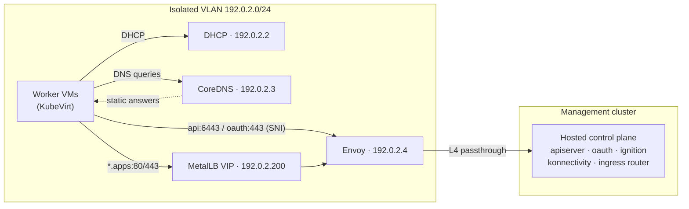

# **oooi** { .gradient-text }

**OpenShift on OpenShift Infra**

oooi provides **DHCP**, **split-horizon DNS**, and a **TLS-passthrough L4
proxy** for KubeVirt worker nodes on an isolated VLAN. It gives hosted workers a
controlled path to their control plane without exposing the management cluster.

[Get started :material-arrow-right:](getting-started/quickstart.md){ .md-button .md-button--primary }
[Architecture :material-sitemap-outline:](architecture.md){ .md-button }

<figure markdown class="oooi-mascot">
  
</figure>

---

## Use case

When you run OpenShift **Hosted Control Planes (HCP)** on **OpenShift
Virtualization** with worker VMs attached to an isolated VLAN
(`attachDefaultNetwork: false`), those workers have *no route* to the hosted
control plane Services, which live on the management cluster's pod network.
Routes on the hosting cluster's ingress and shared load balancers can expose
management-cluster networking to tenant traffic. oooi instead places the
required services on the isolated VLAN. The only cross-network traffic is the
SNI passthrough traffic needed for the configured control-plane Services.

## Capabilities

-   :material-server-network-outline: __Declarative infrastructure__

    ---

    One `Infra` custom resource describes the shared VLAN stack. Create an
    `InfraClusterAttachment` for each hosted cluster that uses it. The operator
    reconciles `DHCPServer`, `DNSServer`, and `ProxyServer` resources and keeps
    them converged. Namespaced children are garbage-collected on delete;
    attachment finalizers and cleanup checks handle hosted, cross-namespace,
    and cluster-scoped resources.

-   :material-ip-network-outline: __Static IPAM with KubeVirt awareness__

    ---

    Each component gets a fixed IP on the secondary network via Multus. The DHCP
    server discovers KubeVirt VM interfaces so existing leases stay stable
    across reconciliation.

-   :material-dns-outline: __Split-horizon DNS__

    ---

    Dual-view CoreDNS: VMs on the VLAN resolve `api.*`, `oauth.*`, and
    `*.apps.*` names to VLAN addresses. When `internalProxyService` is
    configured, management-cluster pods resolve the same names to an internal
    ClusterIP; otherwise static HCP answers are omitted from the default view.
    KubeVirt worker aliases are published to the shared proxy only when source
    addresses are known. Everything else is forwarded upstream.

-   :material-security-network: __TLS passthrough SNI proxy__

    ---

    Envoy routes by Server Name Indication without terminating TLS. Certificates
    never leave the hosted cluster; the proxy sees only encrypted bytes. On a
    shared VLAN, `kubernetes.*` aliases are matched to worker source IPs.

-   :material-apps: __Wildcard apps ingress automation__

    ---

    Installs MetalLB into the hosted cluster, creates the `*.apps.*`
    LoadBalancer VIP for the default IngressController, wires wildcard SNI
    backends, and publishes VLAN DNS. The pod-network DNS answer is added only
    when `internalProxyService` is configured.

-   :label: __ExternalDNS integration__

    ---

    Declarative labels and annotations on LoadBalancer Services let ExternalDNS
    publish OAuth and `*.apps` records to Route53, Azure DNS, or any provider —
    records follow VIP changes automatically.

## How it fits together

For multiple hosted clusters, DNS gives every worker the same proxy address for
the aliases `kubernetes`, `kubernetes.default`, `kubernetes.default.svc`, and
`kubernetes.default.svc.cluster.local`. Envoy chooses the control plane from
the worker's source `/32`. The controller obtains those addresses from CAPI
`Machine.status.addresses`, filtered to the shared `Infra` CIDR; aliases remain
omitted while the address data is unavailable.

## Documentation map

| I want to… | Go to |
|---|---|
| Understand what must exist before installing | [Prerequisites](getting-started/prerequisites.md) |
| Deploy a hosted cluster end to end | [Quickstart](getting-started/quickstart.md) |
| Understand the moving parts | [Architecture](architecture.md) |
| Install / upgrade / remove the operator | [Installation](installation/index.md) |
| Look up an `Infra` spec field | [Infra CR reference](configuration/infra-reference.md) |
| Configure DNS views or upstream resolvers | [Split-horizon DNS](guides/split-horizon-dns.md) |
| Expose consoles and routes (`*.apps`) | [Apps ingress and MetalLB](guides/apps-ingress.md) |
| Publish OAuth / `*.apps` in public DNS | [Public DNS and OAuth publishing](guides/public-dns-oauth.md) |
| Route several hosted clusters on one VLAN | [Multiple hosted clusters](guides/multi-cluster.md) |
| Copy a working manifest | [Examples](examples/index.md) |
| Verify or debug a running deployment | [Operations](operations/index.md) |
