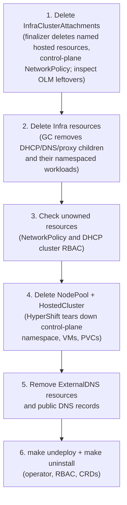

# Uninstall and cleanup

Tear down in the right order. Owner references remove the namespaced child
resources, but cross-namespace, cluster-scoped, and hosted-cluster resources
require a manual check.

## Recommended order



### 1. Delete attachments first

Each `InfraClusterAttachment` finalizer deletes the configured hosted-cluster
Service, `IPAddressPool`, `L2Advertisement`, `MetalLB`, and Subscription by
name, plus its control-plane NetworkPolicy:

```bash
kubectl -n clusters get infraclusterattachment
kubectl -n clusters get infraclusterattachment <name> \
  -o jsonpath='{.status.controlPlaneNamespace}{"\n"}'
kubectl -n clusters delete infraclusterattachment <name>
```

Wait for each attachment to disappear before continuing; a stuck finalizer
usually means the hosted cluster is unreachable.

Cleanup is name-based and does not verify ownership. Use names dedicated to
oooi. It does not remove OLM CSVs, InstallPlans, operator workloads, or public
DNS records; inspect those separately after the attachment is gone.

If the operator is already removed and attachments are stuck `Terminating`,
remove the finalizers manually:

```bash
kubectl -n clusters patch infraclusterattachment <name> --type=merge \
  -p '{"metadata":{"finalizers":null}}'
```

### 2. Delete `Infra` second

Owner references cascade-delete every child object:

```bash
kubectl -n clusters get infra
kubectl -n clusters delete infra <name>

# Child CRs and their namespaced workloads disappear as GC completes:
kubectl -n clusters get dhcpserver,dnsserver,proxyserver   # → No resources found
kubectl -n clusters get all -l app=proxy-server
```

Each attachment-owned external proxy Service is removed when its attachment is
deleted. Apps-ingress resources created in the hosted cluster are not owned by
`Infra`.
Check the hosted cluster for `oooi-ingress`, `metallb`, `IPAddressPool`, and
`L2Advertisement`; remove resources that are no longer required before
expecting the apps-ingress VIP to be released.

### 3. Clean unowned resources

Record each attachment's resolved `status.controlPlaneNamespace` before deleting
it. The control-plane NetworkPolicy is cross-namespace and DHCP's KubeVirt reader
RBAC is cluster-scoped, so Kubernetes cannot use `Infra` as their owner. Check
and remove those resources after deleting the `Infra` resource:

```bash
kubectl -n <control-plane-namespace> delete networkpolicy allow-infrastructure --ignore-not-found
kubectl delete clusterrole <name>-dhcp-kubevirt-reader --ignore-not-found
kubectl delete clusterrolebinding <name>-dhcp-kubevirt-reader --ignore-not-found
```

### 4. Delete the hosted cluster

```bash
kubectl -n clusters delete nodepool <name> --wait=false
kubectl -n clusters delete hostedcluster <name>
```

HyperShift's finalizer then removes the resolved control-plane namespace,
KubeVirt VMs, and PVCs. This can take several minutes:

```bash
kubectl get ns <control-plane-namespace>  # Terminating → NotFound
```

!!! note

    The shared `clusters` namespace is *not* deleted — only the per-cluster
    control-plane namespace is.

### 5. Remove cluster-specific ExternalDNS instances

If you followed [Public DNS and OAuth publishing](../guides/public-dns-oauth.md),
each hosted cluster may have its own watcher. Delete it **before** relying on
record cleanup — a watcher pointed at a destroyed cluster can no longer sync:

```bash
kubectl -n external-dns-operator delete deploy <cluster>-external-dns \
  serviceaccount/<cluster>-external-dns \
  secret/<cluster>-external-dns-kubeconfig \
  secret/<cluster>-external-dns-credentials --ignore-not-found=true
```

### 6. Clean public DNS records

- Records owned by an ExternalDNS running with `--policy=sync` are deleted when
  their Services disappear.
- Orphaned records (owner gone) must be removed from your provider manually,
  e.g. Route53:

  ```bash
  aws route53 change-resource-record-sets --hosted-zone-id <ZONE_ID> \
    --change-batch "$(aws route53 list-resource-record-sets \
      --hosted-zone-id <ZONE_ID> --output json | jq '{Comment:"cleanup",
      Changes: [.ResourceRecordSets[] | select(.Name | contains("<cluster>"))
      | {Action:"DELETE", ResourceRecordSet:.}]}')"
  ```

Verify convergence (`INSYNC`) and that nothing resolves anymore.

### 7. Uninstall the operator

```bash
make undeploy ignore-not-found=true     # Deployment, RBAC, oooi-system namespace
make uninstall ignore-not-found=true    # CRDs
```

## Leftover checklist

After teardown, sweep for cluster-specific remnants:

| Artifact | Check | Action |
|---|---|---|
| Namespaces | `kubectl get ns \| grep <cluster>` | Delete leftover `<cluster>` / `klusterlet-<cluster>` namespaces |
| ACM import agents | `kubectl get managedcluster` | Detach/delete; clear finalizers only if the managed API is already destroyed |
| ClusterRoles/Bindings | `kubectl get clusterrole,clusterrolebinding -o name \| grep <cluster>` | Delete e.g. `<cluster>-dhcp-kubevirt-reader`, ACM addon roles |
| kube-system RBAC | `kubectl -n kube-system get role,rolebinding \| grep <cluster>` | Delete ACM agent roles/bindings |
| Route53/zone records | Query your zone for `<cluster>` | Delete per step 4 |

## Re-installing later

Nothing persists that blocks reuse: re-run `make install && make deploy`, apply
a fresh `Infra`, and recreate the hosted cluster. Use fresh static IPs if any
doubt exists about old leases or VIP assignments.
