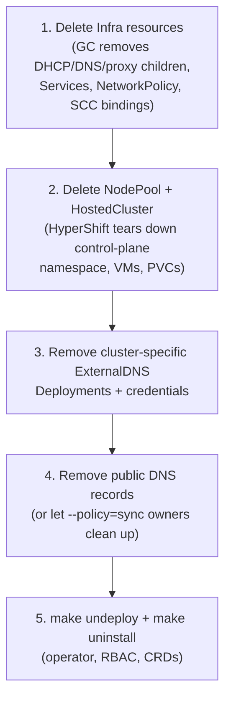

# Uninstall and cleanup

Tear down in the right order so garbage collection does the heavy lifting and
no orphans are left behind.

## Recommended order



### 1. Delete `Infra` first

Owner references cascade-delete every child object:

```bash
kubectl -n clusters get infra
kubectl -n clusters delete infra <name>

# Children disappear as GC completes:
kubectl -n clusters get dhcpserver,dnsserver,proxyserver   # → No resources found
kubectl -n clusters get all,networkpolicy -l app=proxy-server
```

MetalLB releases the VIP automatically (pool usage drops).

### 2. Delete the hosted cluster

```bash
kubectl -n clusters delete nodepool <name> --wait=false
kubectl -n clusters delete hostedcluster <name>
```

HyperShift's finalizer then removes the control-plane namespace
(`clusters-<name>`), KubeVirt VMs, and PVCs. This can take several minutes:

```bash
kubectl get ns clusters-<name>            # Terminating → NotFound
```

!!! note

    The shared `clusters` namespace is *not* deleted — only the per-cluster
    control-plane namespace is.

### 3. Remove cluster-specific ExternalDNS instances

If you followed [Public DNS and OAuth publishing](../guides/public-dns-oauth.md),
each hosted cluster may have its own watcher. Delete it **before** relying on
record cleanup — a watcher pointed at a destroyed cluster can no longer sync:

```bash
kubectl -n external-dns-operator delete deploy <cluster>-external-dns \
  serviceaccount/<cluster>-external-dns \
  secret/<cluster>-external-dns-kubeconfig \
  secret/<cluster>-external-dns-credentials --ignore-not-found=true
```

### 4. Clean public DNS records

- Records owned by an ExternalDNS running with `--policy=sync` are deleted when
  their Services disappear.
- Orphaned records (owner gone) must be removed from your provider manually,
  e.g. Route53:

  ```bash
  aws route53 change-resource-record-sets --hosted-zone-id <ZONE_ID> \
    --change-batch "$(aws route53 list-resource-record-sets \
      --hosted-zone-id <ZONE_ID> --output json | jq '{Comment:"cleanup",
      Changes: [.ResourceRecordSets[] | select(.Name | contains("<cluster>"))
      | {Action:"DELETE", ResourceRecordSet:.}]}')"
  ```

Verify convergence (`INSYNC`) and that nothing resolves anymore.

### 5. Uninstall the operator

```bash
make undeploy ignore-not-found=true     # Deployment, RBAC, oooi-system namespace
make uninstall ignore-not-found=true    # CRDs
```

## Leftover checklist

After teardown, sweep for cluster-specific remnants:

| Artifact | Check | Action |
|---|---|---|
| Namespaces | `kubectl get ns \| grep <cluster>` | Delete leftover `<cluster>` / `klusterlet-<cluster>` namespaces |
| ACM import agents | `kubectl get managedcluster` | Detach/delete; clear finalizers only if the managed API is already destroyed |
| ClusterRoles/Bindings | `kubectl get clusterrole,clusterrolebinding -o name \| grep <cluster>` | Delete e.g. `<cluster>-dhcp-kubevirt-reader`, ACM addon roles |
| kube-system RBAC | `kubectl -n kube-system get role,rolebinding \| grep <cluster>` | Delete ACM agent roles/bindings |
| Route53/zone records | Query your zone for `<cluster>` | Delete per step 4 |

## Re-installing later

Nothing persists that blocks reuse: re-run `make install && make deploy`, apply
a fresh `Infra`, and recreate the hosted cluster. Use fresh static IPs if any
doubt exists about old leases or VIP assignments.
